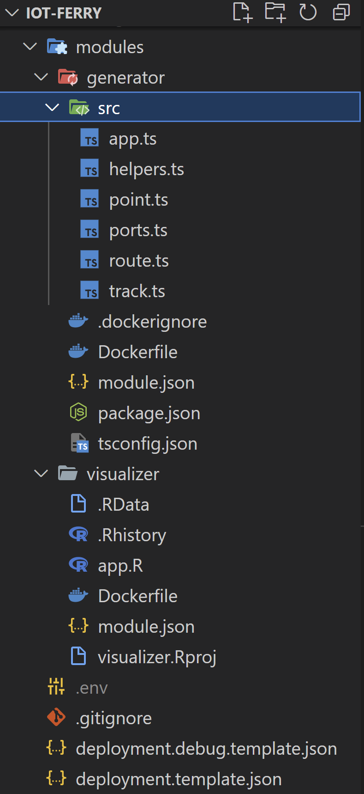
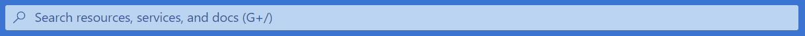
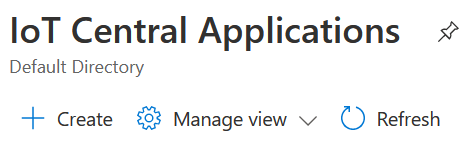

# IoT Edge: R Shiny dashboard

## Summary

In this article we will build an Azure IoT Edge solution with an R Shiny dashboard and a Node.js application as a data generator.

## Glossary

[Microsoft Azure](https://azure.microsoft.com/) is a cloud computing service. Other examples of such services are _Amazon Web Services_ and _Google Cloud Platform_; this article will focus on Azure though.

**IoT** stands for the Internet of Things — the network of physical objects that are embedded with sensors, software, and other technologies for the purpose of connecting and exchanging data with other devices and systems over the internet. An example of an IoT solution would be the network consisting of:

- sensors gathering the temperature data in various parts of a complex factory;
- central server which collects the data from the sensors, analyzes it and makes some short-term predictions;
- automated coolant system which is connected to the same network and operated by the signals from the central server, sent according to short-term predictions of temperature fluctuations;

**IoT Edge** takes the part of a data processing burden from the central server(s) to the IoT devices themselves (the edge). This allows to:

- lower the amount of traffic between IoT devices and the server(s);
- make IoT devices resilient to internet connectivity issues;
- significantly shorten the feedback loop on the IoT system with feedback (the sensor → actuator chain);
- reduce the processing load on the server(s);

In this article we will be working with [Azure IoT Edge](https://azure.microsoft.com/en-us/services/iot-edge/) implementation.

[R](https://www.r-project.org/) is a programming language for statistical computing and graphics. [Shiny](https://shiny.rstudio.com/) is an R package that allows to build interactive fullstack web apps using R.

[Node.js](https://nodejs.org/) is a JavaScript language runtime.

## Application idea

Let's imagine we have a fleet of planes, which are constantly tracking their GPS position during the flight. We want to be able to see the plane's trajectory on the map while being on a plane (even without internet access). We also want to report the plane's speed to the central server (for example, to gather statistics and make some ML models).

For the purpose of this article we will be simulating the plane's coordinates and speed using the Node.js application (modelling GPS and velocity sensors) called **generator** and visualize plane's trajectory in real time on the map using the R Shiny dashboard called **visualizer**.

First, let's implement both **generator** and **visualizer** as a separate applications; later we will organize these applications under the single IoT Edge solution.

## Generator (Node.js)

First, we need to install Node.js using one of two options:

- (for any OS) follow instructions on https://nodejs.org/en/download/
- (for Linux / MacOS / WSL2 in Windows) use [nvm](https://github.com/nvm-sh/nvm#installing-and-updating)

I also suggest to install [Visual Studio Code](https://code.visualstudio.com/): it is useful both to work with a standalone **generator** app and also to work with IoT Edge solution later.

Create a new folder named `generator`, open the terminal, change directory to a newly created folder and type `npm init -y` to initialize a Node.js application. In fact, this command will create a `package.json` file, which is used by Node.js ecosystem.

Open `generator` folder with Visual Studio Code (you can just type `code .` in the terminal). Create a new `index.js` file in a `generator` folder. To test that Node.js is working properly, open `index.js` and type:

```js
console.log("Hi there!");
```

Save the file and modify the `"scripts"` section in a `package.json` file so it looks like this:

```json
"scripts": {
  "start": "node ."
},
```

This will tell Node Package Manager (`npm`) how to execute the application. Next, type `npm start` in the console (while inside the `generator` folder). You should see the string "Hi there!" in the terminal.

Replace the `index.js` file contents with the following well-commented, but obviously non-production-ready code:

```js
// Built-in Node.js module to work with file system
const fs = require("fs").promises;

// Path to a file with generated coordinates
const dataFilePath = "points.csv";

// Limits (min/max values)
const bounds = {
  // Latitude
  lat: {
    min: 10,
    max: 15,
  },
  // Longitude
  lng: {
    min: 40,
    max: 50,
  },
  // Speed
  speed: {
    min: -0.1,
    max: 0.1,
  },
  // Speed alteration
  speedDelta: {
    min: -0.05,
    max: 0.05,
  },
};

// Generate a pseudo-random number between min and max values
const random = ({ min, max }) => Math.random() * (max - min) + min;

// Adjust the value if out of bounds
const bound = ({ min, max }, value) =>
  value > max ? max : value < min ? min : value;

// Are passed coordinates considered to be in the corner (according to map limits)
// Used to get out of corners :)
const isCornered = ({ lat, lng }, lim = bounds.speed.max) => {
  const isLatMin = lat - bounds.lat.min < lim;
  const isLatMax = bounds.lat.max - lat < lim;
  const isLngMin = lng - bounds.lng.min < lim;
  const isLngMax = bounds.lng.max - lng < lim;
  return (
    (isLatMin && isLngMin) ||
    (isLatMin && isLngMax) ||
    (isLatMax && isLngMin) ||
    (isLatMax && isLngMax)
  );
};

// Pause an execution for ms milliseconds
const pause = (ms) => new Promise((res) => setTimeout(res, ms));

// Entrypoint
async function main() {
  console.info("Data generator: started");

  // Plane's current position
  const position = {
    lat: bounds.lat.min + (bounds.lat.max - bounds.lat.min) / 2,
    lng: bounds.lng.min + (bounds.lng.max - bounds.lng.min) / 2,
  };

  // Plane's current speed
  const speed = {
    lat: random(bounds.speed),
    lng: random(bounds.speed),
  };

  // Write a CSV header
  await fs.writeFile(dataFilePath, "lat,lng\n");

  // Infinite loop to generate infinite amount of points
  // Well, at least until the disk is full :)
  while (true) {
    // Generate and write a CSV row with plane's current coordinates
    const line = `${position.lat},${position.lng}`;
    await fs.appendFile(dataFilePath, `${line}\n`);
    console.info(`New line: ${line}`);

    // Update the plane's current position (considering map limits)
    position.lat = bound(bounds.lat, position.lat + speed.lat);
    position.lng = bound(bounds.lng, position.lng + speed.lng);

    // Update the plane's current speed (considering speed limits)
    speed.lat = bound(bounds.speed, speed.lat + random(bounds.speedDelta));
    speed.lng = bound(bounds.speed, speed.lng + random(bounds.speedDelta));

    // Check if plane is cornered and "bounce" out of corner if so
    if (isCornered(position)) {
      console.info("We're cornered! Emergency turnaround!");
      speed.lat = -speed.lat;
      speed.lng = -speed.lng;
    }

    // Wait for one second before generating the next position
    await pause(1000);
  }
}

main();
```

To put it briefly, the logic of the application is: each second the new coordinates are being generated based on previous coordinates and speed; also the speed is adjusted (so the plane randomly rotates a bit after each step). The coordinates are being put into the CSV file. Read the comments to better understand what is going on. Note the `dataFilePath` constant: we will be adjusting its value later. For now, start the Node.js application using `npm start`. You should see some logging in the terminal, for example:

```
Data generator: started
New line: 12.5,45
New line: 12.506069942799334,45.03332979328003
New line: 12.561649826073293,45.069340529851466
New line: 12.644963997856104,45.085814366548576
```

And also `points.csv` file should appear in the application's folder (it should contain the CSV header and the same lines as the terminal output).

You can stop the script execution for now using `Ctrl+C` on your keyboard. Our data emulator is ready!

## Visualizer (R Shiny)

First, you need to install R language and RStudio. I suggest to use this [official instruction](https://www.rstudio.com/products/rstudio/download/) to install both.

Select `File` → `New Project…` from the menu, select `New Directory` → `Shiny Application`, select a convenient path for a new project, type `visualizer` as a directory name and click a `Create Project` button. RStudio will present you with a pre-populated `app.R` source file. You can click `Run App` button in the top right corner of a text editor to start the example R Shiny application and play with it. If you're interested in learning R Shiny, there is an excellent [official tutorial](https://shiny.rstudio.com/tutorial/written-tutorial/lesson1/).

For now, let's replace the code in `app.R` source file with the following (another disclaimer: not for production use):

```r
# R Shiny library (powering the interactive full-stack web application)
library(shiny)
# Leaflet library used to visualize the map
library(leaflet)

# Shiny UI (in this case — just the full-screen leaflet map)
ui <- fluidPage(tags$style(type = "text/css", "#map {height: 100vh !important;}"),leafletOutput("map"))

# Shiny server code (logic)
server <- function(input, output, session) {
  # Path/name of a CSV file with plane positions
  points_file_name = "/tmp/shiny-data/points.csv"

  # Dynamic polling for a CSV file contents
  # Positions are stored as a data.frame
  points <- reactivePoll(
    # Poll each second (1000 ms) for a changes
    1000,
    session,
    # Function to check whether the file modification time has changed
    # To avoid reload the file if it has not been changed
    checkFunc = function() {
      if (file.exists(points_file_name))
        file.info(points_file_name)$mtime[1]
      else
        ""
    },
    # Function to read the file contents
    valueFunc = function() {
      if (file.exists(points_file_name))
        read.csv(points_file_name)
      else
        data.frame(lat = c(),
                   lng = c(),)
    }
  )

  # Render the map into the Shiny UI element
  output$map <- renderLeaflet({
    # The map itself
    leaflet() %>%
      # The map tiles (see https://rstudio.github.io/leaflet/basemaps.html)
      addProviderTiles(providers$Stamen.TonerLite,
                       options = providerTileOptions(noWrap = TRUE)) %>%
      # Starting map lat/lng bounds (hard-coded, don't do that in production code)
      fitBounds(10, 40, 15, 50)
  })

  # Observer which will be triggered when any reactive dependency changes
  # In this particular case the only dependency is the points data frame
  observe({
    pts <- points()
    # This is the way to tell leaflet to apply changes to an already created map
    leafletProxy("map", data = data.matrix(pts)) %>%
      # Change map lat/lng bounds to contain the full trajectory
      fitBounds(min(pts$lat), min(pts$lng), max(pts$lat), max(pts$lng)) %>%
      # Remove all the points / lines
      clearShapes() %>%
      # Add the points (which are actually small circles)
      addCircles(color = "green", weight = 2) %>%
      # Add the trajectory lines
      addPolylines(weight = 0.9)
  })
}

# Start the R Shiny application
shinyApp(ui, server)
```

To put it briefly, the logic of the application is the following: draw a map, zoom it on a provided starting bounds, and start polling the CSV file with plane positions each second. Draw aqcuired points on the map as small circles, connect the circles with lines (to show the trajectory) and zoom-out the map to show full trajectory.

But right now there is no `points.csv` file inside the `visualizer` app, so Shiny application has nothing to draw on the map. Let's fix this.

## Generator & Visualizer: back-to-back

Let's adjust the Node.js `generator` application a bit: we need to put the proper path to an R Shiny application into this variable:

```js
// Path to a file with generated coordinates
const dataFilePath = "points.csv";
```

If you're using MacOS or Linux, this path might look something like this (note: just an example, adjust according to the real path to a `visualizer` application):

```js
const dataFilePath = "/home/me/src/RShiny/visualizer/points.csv";
```

If you're using Windows, it will probably look something like this (note: see the note above):

```js
const dataFilePath = "c:\\Users\\me\\src\\RShiny\\visualizer\\points.csv";
```

After changing this path in `generator` application, (re)start it with `npm start`. After string the `visualizer` application you should see the dynamically updating trajectory on the map.


Now, let's see how can we make these applications to run on IoT Edge device.

## Azure IoT Edge solution

To create an Azure IoT Edge solution, I suggest to install the [Azure IoT Tools](https://marketplace.visualstudio.com/items?itemName=vsciot-vscode.azure-iot-tools) extension pack for Visual Studio Code (both extension pack and IDE itself are free to use). After the extension pack has been installed, open a new Visual Studio Code window, press `Ctrl+Shift+P` to display the command palette, and start typing "Azure IoT Edge". You should see the item `Azure IoT Edge: New IoT Edge Solution`. Click on it, select a path where you want your solution to be stored; then enter the name of the solution (for example, `iot-plane`); then select `Empty Solution`.

You can see that several files and a directory named `modules` were created. The `deployment.template.json` file describes the IoT Edge device template; the `deployment.debug.template.json` is the debug version of `deployment.template.json`. The `modules` directory is empty for now; we will be adding our two applications as an IoT Edge modules there shortly. As the [official documentation](https://docs.microsoft.com/en-us/azure/iot-edge/iot-edge-modules?view=iotedge-2020-11) says, the modules are the smallest unit of computation managed by IoT Edge.

Let's start converting our applications to IoT Edge modules by copying `generator` and `visualizer` folders into the `modules` directory of `iot-plane` solution. The structure should look like this:



Azure IoT Edge works with containerized modules, so we need to provide instructions on how to build containers for each module. Let's add a `Dockerfile` for both `generator` and `visualizer` applications. An annotated example of a `Dockerfile` for Node.js application (`generator`) (**TBD: needs to be refined**):

```Dockerfile
# Base image for this container
FROM node:16-alpine3.16

# Create a temporary directory for a CSV document
RUN mkdir /tmp/shiny-data
# Set a "free-for-all" permissions on this directory
RUN chmod 777 /tmp/shiny-data
# Create an application directory and set proper permissions
RUN mkdir -p /home/node/app && chown -R node:node /home/node/app
# Change current directory to an application folder
WORKDIR /home/node/app
# Switch user to node
USER node
# Copy project files into the container
COPY --chown=node:node . .
# Start the Node.js application
CMD [ "npm", "start" ]
```

An annotated example of a `Dockerfile` for R Shiny application (`visualizer`):

```Dockerfile
# Base image for this container
FROM rocker/shiny:4.2.1

# Install dependencies
RUN R -e 'install.packages(c(\
  "shinyjs", \
  "leaflet" \
  ) \
  )'

# Remove all the Rocker example project files
RUN rm -rf /srv/shiny-server/**
# Copy application files into the container
COPY . /srv/shiny-server/
```

In order for Azure IoT Tools to understand that the applications inside the `modules` directory are indeed the IoT Edge modules, we need to add a `module.json` file to both `generator` and `visualizer` sub-folders. Example of such file for the `generator`:

```json
{
  "$schema-version": "0.0.1",
  "description": "Plane coordinates generator",
  "image": {
    "repository": "${CONTAINER_REGISTRY_SERVER}/generator",
    "tag": {
      "version": "0.0.1",
      "platforms": {
        "amd64": "./Dockerfile"
      }
    },
    "buildOptions": []
  },
  "language": "javascript"
}
```

And here is an example of a `module.json` file for the `visualizer`:

```json
{
  "$schema-version": "0.0.1",
  "description": "Plane trajectory visualizer",
  "image": {
    "repository": "${CONTAINER_REGISTRY_SERVER}/visualizer",
    "tag": {
      "version": "0.0.1",
      "platforms": {
        "amd64": "./Dockerfile"
      }
    },
    "buildOptions": []
  },
  "language": "R"
}
```

As you can see, the structure of these `module.json` files is quite trivial.

Next, we need to adjust `deployment.template.json` so it will contain information about our modules. Open this file, locate the empty section:

```json
"modules": {}
```

and replace it with the following:

```json
"modules": {
  "generator": {
    "version": "0.0.1",
    "type": "docker",
    "status": "running",
    "restartPolicy": "always",
    "settings": {
      "image": "${MODULES.generator}",
      "createOptions": {
        "HostConfig": {
          "Binds": ["shiny-data:/tmp/shiny-data"]
        }
      }
    }
  },
  "visualizer": {
    "version": "0.0.1",
    "type": "docker",
    "status": "running",
    "restartPolicy": "always",
    "settings": {
      "image": "${MODULES.visualizer}",
      "createOptions": {
        "HostConfig": {
          "Binds": ["shiny-data:/tmp/shiny-data"],
          "PortBindings": {
            "3838/tcp": [
              {
                "HostPort": "8765"
              }
            ]
          }
        }
      }
    }
  }
}
```

**TBD: detailed deployment.template.json description**

Also, we need to let IoT Edge tools know where to put docker images (these will be built a bit later). At the moment we will use local container registry. To do so we need to set up several environment variables by creating .env file in solution's root directory (`iot-plane`) and pasting these variables there:

```sh
CONTAINER_REGISTRY_SERVER="localhost:5000"
CONTAINER_REGISTRY_USERNAME=""
CONTAINER_REGISTRY_PASSWORD=""
```

After that right-click on the `deployment.template.json` and select `Build and run IoT Edge solution in Simulator`. After some time and quite a lot of terminal output, you should see the logs from `visualizer` and `generator`. Open http://localhost:8765/ in the browser and you should see R Shiny application, working as an IoT Edge module in simulator. To stop the simulator, press `Ctrl+C` in the terminal.

## Azure Infrastructure

Let's setup a required infrastructure for our project. Login into the account (or create a new one) in [Microsoft Azure](https://azure.microsoft.com/). After you've reached the [Azure Portal](https://portal.azure.com/) (you should be redirected there automatically), click into the search box (at the top of the screen):



And type `IoT Central` there, then click on `IoT Central Applications` in the popup. **IoT Central** is a platform-as-a-service solution for managing IoT devices.

After you opened the `IoT Central Applications` screen, click on the "Create" button (at the left of the screen):



Select your default subscription (should be created automatically along with Azure account). Create a new resource group named `rg-plane` ("rg" is a short for a "resource group") and select it. Enter `iot-central-plane` as a resource name and when you switch to the "Application URL" field, it should be automatically pre-populated with the same string as an URL prefix. Note: this resource name should be globally unique across the world, so you might need to add some postfix to it — like your nickname or current date. Select `Custom application` as a template, pick the region closest to you and select `Standard 0` price plan. Click `Review + create` button, wait for a next screen to load and press `Create` button. You should be redirected to the newly created IoT Central application deployment screen, which will say "Deployment is in progress" for a while. Wait until the deployment is done, then click `Go to resource` button. You will be redirected to the IoT Central application overview screen. Click on the `IoT Central Application URL` (right part of the screen) to open a dedicated URL of a newly created IoT Central application.
