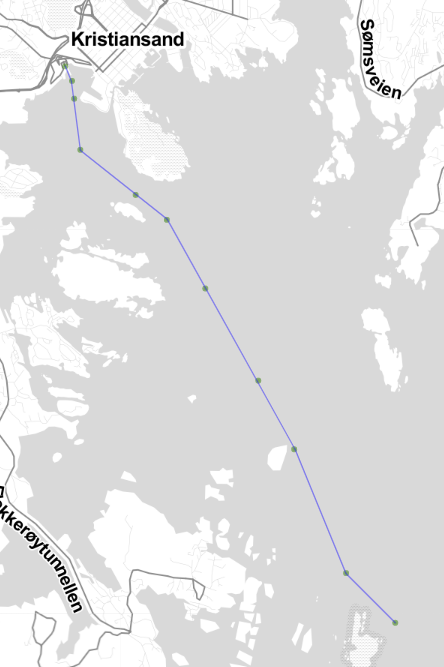
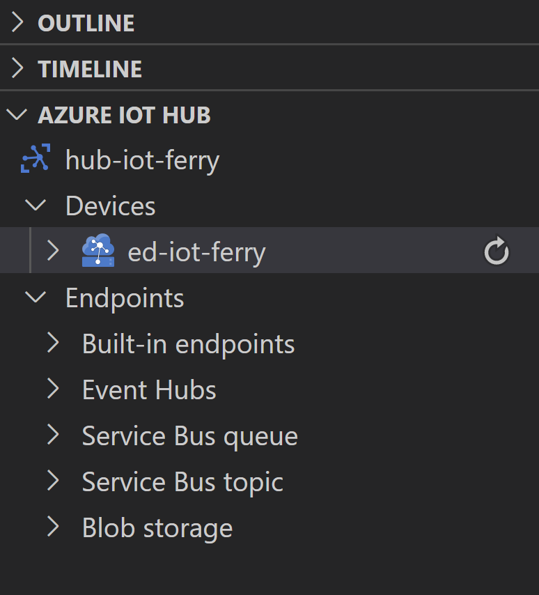

# IoT Edge: R Shiny dashboard (draft)

## Summary

In this article we will build an Azure IoT Edge solution with an R Shiny dashboard and a Node.js application as a data generator.

## Glossary

[Microsoft Azure](https://azure.microsoft.com/) is a cloud computing service. Other examples of such services are _Amazon Web Services_ and _Google Cloud Platform_. This article will focus on Azure.

**IoT** stands for the Internet of Things — the network of physical objects that are embedded with sensors, software, and other technologies for the purpose of connecting and exchanging data with other devices and systems over the internet. An example of an IoT solution would be the network consisting of:

- sensors gathering the temperature data in various parts of a complex factory;
- central server which collects the data from the sensors, analyzes it and makes some short-term predictions;
- automated coolant system which is connected to the same network and operated by the signals from the central server, sent according to short-term predictions of temperature fluctuations;

**IoT Edge** takes the part of a data processing burden from the central server(s) to the IoT devices themselves (the edge). This allows to:

- lower the amount of traffic between IoT devices and the server(s);
- make IoT devices resilient to internet connectivity issues;
- significantly shorten the feedback loop on the IoT system with feedback (the sensor → actuator chain);
- reduce the processing load on the server(s);

In this article we will be working with [Azure IoT Edge](https://azure.microsoft.com/en-us/services/iot-edge/) implementation.

[R](https://www.r-project.org/) is a programming language for statistical computing and graphics. [Shiny](https://shiny.rstudio.com/) is an R package that allows to build interactive fullstack web apps using R.

[Node.js](https://nodejs.org/) is a JavaScript language runtime.

## Application idea

Let's imagine we have a fleet of ferries, which are constantly tracking their GPS position during the trip. We want to be able to see the ferry's trajectory on the map while being on a ferry (even without internet access). We also want to report the ferry's speed to the central server (for example, to gather statistics and make some ML models).

For the purpose of this article we will be generating the ferry's coordinates using the Node.js application (modelling GPS and velocity sensors) called **generator** and visualize ferry's trajectory in real time on the map using the R Shiny dashboard called **visualizer**. We will also report the ferry's current position to another module called **analyzer**, which will have quite a simple job: to calculate the total distance traveled by the ferry and to report this total distance to a central hub.

First, let's implement both **generator** and **visualizer** as a separate applications; later we will organize these applications under the single IoT Edge solution and will also add an **analyzer** module.

## Generator (Node.js)

First, we need to install Node.js using one of two options:

- (for any OS) follow instructions on https://nodejs.org/en/download/
- (for Linux / MacOS / WSL2 in Windows) use [nvm](https://github.com/nvm-sh/nvm#installing-and-updating)

I also suggest to install [Visual Studio Code](https://code.visualstudio.com/): it is useful both to work with a standalone **generator** app and also to work with IoT Edge solution later.

Create a new folder named `generator`, open the terminal, change directory to a newly created folder and type `npm init -y` to initialize a Node.js application. In fact, this command will create a `package.json` file, which is used by the Node.js ecosystem.

Open `generator` folder with Visual Studio Code (you can just type `code .` in the terminal). We will be using TypeScript for our Node.js modules, so there are a couple of extra steps to get everything running. First, create a tsconfig.json file (its needed to provide TypeScript tools with proper configuration options) with the following contents:

```json
{
  "ts-node": {
    "files": true,
    "transpileOnly": true
  },
  "exclude": ["public"],
  "compilerOptions": {
    "target": "es2016",
    "module": "commonjs",
    "rootDir": "./src",
    "baseUrl": "./",
    "outDir": "./build",
    "esModuleInterop": true,
    "forceConsistentCasingInFileNames": true,
    "strict": true,
    "exactOptionalPropertyTypes": true,
    "skipLibCheck": true
  }
}
```

I won't get into the details on each option' semantics here; if you're interested — all the information is [here](https://www.typescriptlang.org/tsconfig).

Next, we need to install two npm modules (`@types/node` needed for TypeScript to recognize standard Node.js internals/libraries; `ts-node` is a TypeScript execution engine for Node.js):

```sh
npm i -D @types/node
npm i ts-node
```

Create an `src` directory under the project's root, and put the `app.ts` file there with the following contents:

```ts
console.log("Hi there!");
```

Save the file and modify the `"scripts"` section in a `package.json` file so it looks like this:

```json
"scripts": {
  "start": "ts-node src/app.ts"
},
```

This will tell Node Package Manager (`npm`) how to start the application. Next, type `npm start` in the console (while inside the `generator` folder). You should see the string "Hi there!" in the terminal.

Now we need to implement our ferry "simulator" engine. It will consist of several TypeScript modules, which will be listed below with exhaustive comments.

The `src/helpers.ts` module contains several helper functions:

```ts
// Generate a pseudo-random number between min and max values
export const random = (min: number, max: number) =>
  Math.random() * (max - min) + min;

// Pause an execution for ms milliseconds
export const pause = (ms: number) => new Promise((res) => setTimeout(res, ms));

// Exit process with optional error reporting
export function exit(code: number, error?: unknown): never {
  if (error) console.error(error);
  process.exit(code);
}
```

The `src/point.ts` module contains the `Point` class, which will be used to describe ferry coordinates:

```ts
// Helper class describing map coordinates pair
export class Point {
  // Create a point with latitude and longitude
  constructor(public lat: number, public lng: number) {}

  // Update a point with the coordinates from another point
  update(point: Point) {
    this.lat = point.lat;
    this.lng = point.lng;
  }

  // Calculate the distance between two points
  static distance(point1: Point, point2: Point) {
    return Math.sqrt(
      Math.pow(point2.lat - point1.lat, 2) +
        Math.pow(point2.lng - point1.lng, 2)
    );
  }

  // Create a new point's instance from the existing point
  static from(point: Point) {
    return new Point(point.lat, point.lng);
  }
}
```

The `src/ports.ts` module describes ports a ferry will be travelling between; each port entry also contains a list of coordinates — to help the ferry to sail the narrow parts of the path from/to the port; we will call these points "breadcrumbs" below:

```ts
import { Point } from "./point";

// Port data format
export interface Port {
  // Port's name (just for illustrative purposes)
  name: string;
  // Breadcrumb points — describes how to sail the narrow parts of the path from the port
  breadcrumbs: Point[];
}

// List of ports to work with
export const ports: Port[] = [
  {
    name: "Hirtshals, Denmark",
    breadcrumbs: [
      new Point(57.592841, 9.966922),
      new Point(57.595534, 9.963483),
      new Point(57.597369, 9.958817),
      new Point(57.599751, 9.958033),
      new Point(57.601585, 9.956994),
    ],
  },
  {
    name: "Kristiansand, Norway",
    breadcrumbs: [
      new Point(58.144044, 7.985321),
      new Point(58.14229, 7.98688),
      new Point(58.140142, 7.98738),
      new Point(58.133968, 7.988785),
      new Point(58.128519, 8.001452),
      new Point(58.125508, 8.008597),
      new Point(58.117212, 8.017392),
      new Point(58.09778, 8.037732),
      new Point(58.076788, 8.060878),
      new Point(58.041643, 8.108352),
    ],
  },
  {
    name: "Larvik, Norway",
    breadcrumbs: [
      new Point(59.041698, 10.045262),
      new Point(59.040981, 10.042309),
      new Point(59.038086, 10.03398),
      new Point(59.035695, 10.033933),
      new Point(59.025676, 10.041152),
      new Point(59.01797, 10.04746),
      new Point(59.001897, 10.066968),
      new Point(58.993137, 10.091842),
      new Point(58.972646, 10.095421),
    ],
  },
];
```

The `src/track.ts` module contains the `Track` class, which is responsible for keeping track of "breadcrumbs" and to advance the ferry's position between the "breadcrumbs" and in open waters:

```ts
import { random } from "./helpers";
import { Point } from "./point";

// Helper class designed to:
// - keep track [:)] of "breadcrumbs" to help ferry navigate in narrow areas
// - advance ferry's position between the "breadcrumbs"
export class Track {
  // List of track's breadcrumb points
  private points: Point[];
  // Current target (point's index)
  private index: number;
  // Current ferry's position
  private position: Point;

  constructor(originBreadcrumbs: Point[], destinationBreadcrumbs: Point[]) {
    // Combine origin and destination ports' breadcrumbs into the single array
    // (note reversing the destination port's points: they are in "departure" order)
    this.points = originBreadcrumbs.concat(
      [...destinationBreadcrumbs].reverse()
    );
    // Current target point is the first ("zeroth" actually) breadcrumb
    this.index = 0;
    // Set the position based on the first breadcrumb
    this.position = Point.from(this.target);
  }

  // Get the current breadcrumb point
  private get target() {
    return this.points[this.index];
  }

  // Get the last breadcrumb point
  private last() {
    return this.points[this.points.length - 1];
  }

  // True if ferry arrived at last breadcrumb point
  public done() {
    return this.index >= this.points.length;
  }

  // Advance the ferry on track and return a ferry's new position
  public next(averageSpeed: number, jitter: number): Point {
    // If we're arrived at the last breadcrumb — just return that last point
    if (this.done()) return Point.from(this.last());
    // Calculate the distance between the target breadcrumb and ferry's current position
    const distance = Point.distance(this.target, this.position);
    // If distance is less than or equal to average speed
    if (distance <= averageSpeed) {
      // Jump to the target breadcrumb
      this.position.update(this.target);
      // Set the next breadcrumb as a target
      this.index += 1;
      // Otherwise — advance to next breadcrumb using some primitive math
    } else {
      // Calculate the "ideal" step count between current position and the target
      const stepCount = distance / averageSpeed;
      // Increment the current position's latitude with average distance plus some randomness
      this.position.lat +=
        (this.target.lat - this.position.lat) / stepCount +
        random(-jitter, jitter);
      // Increment the current position's longitude with average distance plus some randomness
      this.position.lng +=
        (this.target.lng - this.position.lng) / stepCount +
        random(-jitter, jitter);
    }
    return this.position;
  }
}
```

The `src/ferry.ts` module contains the `Ferry` class, which helps the ferry to navigate between ports and using the `Track` instance to generate the ferry coordinates:

```ts
import { random } from "./helpers";
import { Port } from "./ports";
import { Track } from "./track";

interface FerryOptions {
  ports: Port[];
  averageSpeed?: number;
  jitter?: number;
}

// Helper class to generate ferry's route points
export class Ferry {
  // List of ports with breadcrumbs
  private ports: Port[];
  // Ferry's average speed
  private averageSpeed: number;
  // Ferry's default average speed
  static readonly defaultAverageSpeed = 0.02;
  // Trajectory calculation' randomness factor
  private jitter: number;
  // Default trajectory calculation' randomness factor
  static readonly defaultJitter = 0.005;
  // Current origin port index
  private originIndex: number;
  // Current destination port index
  private destinationIndex: number;
  // "Breadcrumbs" to help ferry navigate in narrow areas
  private track: Track;

  constructor({ ports, averageSpeed, jitter }: FerryOptions) {
    // Initialize the configuration options
    this.ports = ports;
    this.averageSpeed = averageSpeed || Ferry.defaultAverageSpeed;
    this.jitter = jitter || Ferry.defaultJitter;
    // Start in a random port
    this.originIndex = Math.floor(random(0, this.ports.length));
    // Pick a destination port
    this.destinationIndex = this.pickDestination();
    // Make a joined track from both ports' breadcrumbs
    this.track = this.makeTrack();
  }

  // Update the ferry's average speed
  setAverageSpeed(averageSpeed: number) {
    this.averageSpeed = averageSpeed;
  }

  // Update the trajectory calculation' randomness factor
  setJitter(jitter: number) {
    this.jitter = jitter;
  }

  // Pick a destination port
  private pickDestination() {
    // Simply select a next port in the list
    const index = this.originIndex + 1;
    // Mind the overflow
    return index >= this.ports.length ? 0 : index;
  }

  // Create a track from origin and destination ports' breadcrumbs
  private makeTrack() {
    return new Track(this.origin.breadcrumbs, this.destination.breadcrumbs);
  }

  // Get the current origin port
  private get origin() {
    return this.ports[this.originIndex];
  }

  // Get the current destination port
  private get destination() {
    return this.ports[this.destinationIndex];
  }

  // Advance the ferry and return the ferry's position
  // Pick the next port if arrived to a destination
  public next() {
    // Generate next position based on a track
    const position = this.track.next(this.averageSpeed, this.jitter);
    // If a ferry reached final track's position (destination)
    if (this.track.done()) {
      // Set the current port as an origin
      this.originIndex = this.destinationIndex;
      // Pick the next destination port
      this.destinationIndex = this.pickDestination();
      // Reinitialize the breadcrumbs track
      this.track = this.makeTrack();
    }
    return position;
  }
}
```

Finally, the `src/app.ts` module, which orchestrates everything together:

```ts
import { promises as fs } from "fs";
import { pause } from "./helpers";

import { ports } from "./ports";
import { Ferry } from "./ferry";
import { Point } from "./point";

// Path to a file with generated coordinates
const dataFilePath = "route.csv";

// Entrypoint
async function main() {
  console.info("Data generator: started");

  // Initialize a ferry object
  const ferry = new Ferry({ ports });

  // Write a CSV header
  await fs.writeFile(dataFilePath, "lng,lat\n");

  // Infinite loop to generate infinite amount of points
  // Well, at least until the disk is full :)
  while (true) {
    // Generate a ferry's next position
    const position = ferry.next();

    // Generate and write a CSV row with ferry's current position
    const line = `${position.lng},${position.lat}`;
    await fs.appendFile(dataFilePath, `${line}\n`);
    console.info(`New line: ${line}`);

    // Wait for one second before generating the next position
    await pause(1000);
  }
}

main();
```

To put it briefly, the logic of the application is: ferry is moving between three pre-defined ports. Each second new ferry coordinates are being generated based on "breadcrumbs", previous coordinates, speed and randomness factor (jitter). The coordinates are being put into the CSV file. Read the comments to better understand what is going on. Note the `dataFilePath` constant: we will be adjusting its value later. For now, start the Node.js application using `npm start`. You should see some logging in the terminal, for example:

```
Data generator: started
New line: 7.985321,58.144044
New line: 7.98688,58.14229
New line: 7.98738,58.140142
New line: 7.988785,58.133968
New line: 8.001452,58.128519
New line: 8.008597,58.125508
```

And also `route.csv` file should appear in the application's folder (it should contain the CSV header and the same lines as the terminal output).

You can stop the script execution for now using `Ctrl+C` on your keyboard. Our data emulator is ready for now (later we will adjust its code to provide some IoT messaging capabilities).

## Visualizer (R Shiny)

First, you need to install R language and RStudio. I suggest to use this [official instruction](https://www.rstudio.com/products/rstudio/download/) to install both.

Select `File` → `New Project…` from the menu, select `New Directory` → `Shiny Application`, select a convenient path for a new project, type `visualizer` as a directory name and click a `Create Project` button. RStudio will present you with a pre-populated `app.R` source file. You can click `Run App` button in the top right corner of a text editor to start the example R Shiny application and play with it. If you're interested in learning R Shiny, there is an excellent [official tutorial](https://shiny.rstudio.com/tutorial/written-tutorial/lesson1/).

For now, let's replace the code in `app.R` source file with the following (another disclaimer: not for production use):

```r
# R Shiny library (powering the interactive full-stack web application)
library(shiny)
# Leaflet library used to visualize the map
library(leaflet)

# Shiny UI (in this case — just the full-screen leaflet map)
ui <- fluidPage(tags$style(type = "text/css", "#map {height: 100vh !important;}"),leafletOutput("map"))

# Shiny server code (logic)
server <- function(input, output, session) {
  # Path/name of a CSV file with ferry positions
  points_file_name = "route.csv"

  # Dynamic polling for a CSV file contents
  # Positions are stored as a data.frame
  points <- reactivePoll(
    # Poll each second (1000 ms) for a changes
    1000,
    session,
    # Function to check whether the file modification time has changed
    # To avoid reload the file if it has not been changed
    checkFunc = function() {
      if (file.exists(points_file_name))
        file.info(points_file_name)$mtime[1]
      else
        ""
    },
    # Function to read the file contents
    valueFunc = function() {
      if (file.exists(points_file_name))
        read.csv(points_file_name)
      else
        data.frame(lat = c(),
                   lng = c(),)
    }
  )

  # Render the map into the Shiny UI element
  output$map <- renderLeaflet({
    # The map itself
    leaflet() %>%
      # The map tiles (see https://rstudio.github.io/leaflet/basemaps.html)
      addProviderTiles(providers$Stamen.TonerLite,
                       options = providerTileOptions(noWrap = TRUE)) %>%
      # Starting map lat/lng bounds (hard-coded, don't do that in production code)
      fitBounds(7.9, 57.5, 10.1, 59.1)
  })

  # Observer which will be triggered when any reactive dependency changes
  # In this particular case the only dependency is the points data frame
  observe({
    pts <- points()
    # This is the way to tell leaflet to apply changes to an already created map
    leafletProxy("map", data = data.matrix(pts)) %>%
      # Remove all the points / lines
      clearShapes() %>%
      # Add the points (which are actually small circles)
      addCircles(color = "green", weight = 2) %>%
      # Add the trajectory lines
      addPolylines(weight = 0.9)
  })
}

# Start the R Shiny application
shinyApp(ui, server)
```

To put it briefly, the logic of the application is the following: draw a map, zoom it on a provided starting bounds, and start polling the CSV file with ferry positions each second. Draw aqcuired points on the map as small circles, connect the circles with lines (to show the trajectory).

But right now there is no `route.csv` file inside the `visualizer` app, so Shiny application has nothing to draw on the map. Let's fix this.

## Generator & Visualizer: back-to-back

Let's adjust the Node.js `generator` application a bit: we need to put the proper path to an R Shiny application into this variable:

```js
// Path to a file with generated coordinates
const dataFilePath = "route.csv";
```

If you're using MacOS or Linux, this path might look something like this (note: this is just an example, you need to adjust the value according to the real path to a `visualizer` application in your system):

```js
const dataFilePath = "/home/me/src/RShiny/visualizer/route.csv";
```

If you're using Windows, it will probably look something like this (also see the note above):

```js
const dataFilePath = "c:\\Users\\me\\src\\RShiny\\visualizer\\route.csv";
```

After changing this path in `generator` application, (re)start it with `npm start`. After string the `visualizer` application you should see the dynamically updating trajectory on the map.



Now, let's see how can we make these applications to run on IoT Edge device.

## Azure IoT Edge solution

To create an Azure IoT Edge solution, I suggest to install the [Azure IoT Tools](https://marketplace.visualstudio.com/items?itemName=vsciot-vscode.azure-iot-tools) extension pack for Visual Studio Code (both extension pack and IDE itself are free to use). After the extension pack has been installed, open a new Visual Studio Code window, press `Ctrl+Shift+P` to display the command palette, and start typing "Azure IoT Edge". You should see the item `Azure IoT Edge: New IoT Edge Solution`. Click on it, select a path where you want your solution to be stored; then enter the name of the solution (for example, `iot-ferry`); then select `Empty Solution`.

You can see that several files and a directory named `modules` were created. The `deployment.template.json` file describes the IoT Edge device template; the `deployment.debug.template.json` is the debug version of `deployment.template.json`. The `modules` directory is empty for now; we will be adding our two applications as an IoT Edge modules there shortly. As the [official documentation](https://docs.microsoft.com/en-us/azure/iot-edge/iot-edge-modules?view=iotedge-2020-11) says, the modules are the smallest unit of computation managed by IoT Edge.

Let's start converting our applications to IoT Edge modules by copying `generator` and `visualizer` folders into the `modules` directory of the `iot-ferry` solution. The structure should look like this:


Azure IoT Edge works with containerized modules, so we need to provide instructions on how to build containers for each module. Let's add a `Dockerfile` for both `generator` and `visualizer` applications. An annotated example of a `Dockerfile` for Node.js application (`generator`):

```Dockerfile
# Base image for this container
FROM node:16-alpine3.16

# Create a temporary directory for a CSV document
RUN mkdir /tmp/shiny-data
# Set a "free-for-all" permissions on this directory
RUN chmod 777 /tmp/shiny-data
# Create an application directory and set proper permissions
RUN mkdir -p /home/node/app/node_modules && chown -R node:node /home/node/app
# Change current directory to an application folder
WORKDIR /home/node/app
# Switch user to node
USER node
# Copy package.json and package-lock.json into the container
COPY package.json ./
# Install dependencies
RUN npm install
# Copy project files into the container
COPY --chown=node:node . .
# Start the Node.js application
CMD [ "npm", "start" ]
```

An annotated example of a `Dockerfile` for R Shiny application (`visualizer`):

```Dockerfile
# Base image for this container
FROM rocker/shiny:4.2.1

# Install dependencies
RUN R -e 'install.packages(c(\
  "shinyjs", \
  "leaflet" \
  ) \
  )'

# Remove all the Rocker example project files
RUN rm -rf /srv/shiny-server/**
# Copy application files into the container
COPY ./app.R /srv/shiny-server/
```

In order for Azure IoT Tools to understand that the applications inside the `modules` directory are indeed the IoT Edge modules, we need to add a `module.json` file to both `generator` and `visualizer` sub-folders. Example of such file for the `generator`:

```json
{
  "$schema-version": "0.0.1",
  "description": "Ferry coordinates generator",
  "image": {
    "repository": "${CONTAINER_REGISTRY_SERVER}/generator",
    "tag": {
      "version": "0.0.1",
      "platforms": {
        "amd64": "./Dockerfile"
      }
    },
    "buildOptions": []
  },
  "language": "javascript"
}
```

And here is an example of a `module.json` file for the `visualizer`:

```json
{
  "$schema-version": "0.0.1",
  "description": "Ferry trajectory visualizer",
  "image": {
    "repository": "${CONTAINER_REGISTRY_SERVER}/visualizer",
    "tag": {
      "version": "0.0.1",
      "platforms": {
        "amd64": "./Dockerfile"
      }
    },
    "buildOptions": []
  },
  "language": "R"
}
```

As you can see, the structure of these `module.json` files is quite trivial.

Next, we need to adjust `deployment.template.json` so it will contain information about our modules. Open this file, locate the empty section:

```json
"modules": {}
```

and replace it with the following:

```json
"modules": {
  "generator": {
    "version": "0.0.1",
    "type": "docker",
    "status": "running",
    "restartPolicy": "always",
    "settings": {
      "image": "${MODULES.generator}",
      "createOptions": {
        "HostConfig": {
          "Binds": ["shiny-data:/tmp/shiny-data"]
        }
      }
    }
  },
  "visualizer": {
    "version": "0.0.1",
    "type": "docker",
    "status": "running",
    "restartPolicy": "always",
    "settings": {
      "image": "${MODULES.visualizer}",
      "createOptions": {
        "HostConfig": {
          "Binds": ["shiny-data:/tmp/shiny-data"],
          "PortBindings": {
            "3838/tcp": [
              {
                "HostPort": "8765"
              }
            ]
          }
        }
      }
    }
  }
}
```

Important parts are:
- `"Binds"` field, which describes mapping of a Docker volume to a filesystem path (needed so modules would share a filesystem volume to have access to the same `routes.csv` file)
- `"PortBindings"` field, which describes ports mapping for R Shiny app: port `3838` from inside the container will be mapped to port `8765` accesible from outside (so you will be able to access R Shiny app in browser)

You can get more information on deployment template syntax [here](https://docs.microsoft.com/en-us/azure/iot-edge/module-composition?view=iotedge-2020-11).

Also, we need to let IoT Edge tools know where to put docker images (these will be built a bit later). At the moment we will use local container registry. To do so we need to set up several environment variables by creating .env file in solution's root directory (`iot-ferry`) and pasting these variables there:

```sh
CONTAINER_REGISTRY_SERVER="localhost:5000"
CONTAINER_REGISTRY_USERNAME=""
CONTAINER_REGISTRY_PASSWORD=""
```

After that right-click on the `deployment.template.json` and select `Build and run IoT Edge solution in Simulator`. After some time and quite a lot of terminal output, you should see the logs from `visualizer` and `generator`. Open http://localhost:8765/ in the browser and you should see R Shiny application, working as an IoT Edge module in the simulator. To stop the simulator, press `Ctrl+C` in the terminal.

## Modules: messaging and dynamic properties

Azure IoT Edge provides module←→module and module←→cloud communication capabilities. Let's utilize these capabilities to:
- allow to modify ferry's average speed and jitter dynamically from the cloud
- report ferry's current position to the separate `analyzer` module
- calculate total distance in the `analyzer` module and report it periodically to the cloud

First, let's install a couple of npm dependencies into the `generator` module (these will allow to use Azure IoT device API):

```sh
npm i azure-iot-device azure-iot-device-mqtt
```

Next, let's add a new TypeScript file `src/iot.ts` to the `generator` module. This file contain a helper class to incapsulate the interaction with IoT Hub:

```ts
import { Mqtt as Transport } from "azure-iot-device-mqtt";
import { ModuleClient as Client, Twin } from "azure-iot-device";
import { Message } from "azure-iot-device";
import { exit } from "./helpers";

// Properties which could be controlled from IoT Hub
interface TwinDesiredProperties {
  AverageSpeed?: number;
  Jitter?: number;
}

// Type describing the callback for a properties change
type TwinDesiredPropertiesCallback = (props: TwinDesiredProperties) => void;
// Type describing the callback for a new message
type MessageCallback = (input: string, data: string) => void;

// Options used when creating IoTClient
interface IoTClientOptions {
  // Callback for a new message
  onMessage: MessageCallback;
  // Callback for a properties change
  onTwinDesiredProperties: TwinDesiredPropertiesCallback;
}

// Helper class to work with IoT Client
export class IoTClient {
  constructor(private client: Client) {}

  // Create a new IoTClient instance
  static async create({
    onMessage,
    onTwinDesiredProperties,
  }: IoTClientOptions) {
    try {
      // Create and initialize IoT Client
      const client = await Client.fromEnvironment(Transport);
      client.on("error", exit.bind(-1));
      await client.open();
      console.info("IoT Hub module client initialized");

      // React to an incoming message
      client.on("inputMessage", (input: string, message: Message) => {
        // Transform the message data to a string
        const data = message.getBytes().toString("utf-8");
        console.info(
          `Message received: input=${input}; data=${data}`
        );
        // Execute the passed callback
        onMessage(input, data);
      });

      // Initialize modules twin
      const twin = await client.getTwin();
      // Execute the passed callback with the immediately received properties
      onTwinDesiredProperties(twin.properties.desired);
      // React to properties change
      twin.on("properties.desired", (delta) => {
        // Execute the passed callback with the received properties delta
        onTwinDesiredProperties(delta);
      });

      return new IoTClient(client);
    } catch (error) {
      exit(-1, error);
    }
  }

  // Send the data to the named output as an IoT message
  async send(output: string, data: string) {
    const message = new Message(data);
    await this.client.sendOutputEvent(output, message);
    console.info(
      `Message sent: output=${output}; data=${data}`
    );
  }
}
```

Next, we need to use `IoTClient` class in `src/app.ts`. First, import it:

```ts
import { IoTClient } from "./iot";
```

After that, initialize it and provide message and properties change handlers (this code need to be put right after initializing the `ferry` object):

```ts
  // Create an IoT Client
  const iotClient = await IoTClient.create({
    // When new message arrives,
    onMessage: (input, data) => {
      // Just log it to the console
      console.info(input, data);
    },
    // When module twin properties changes,
    onTwinDesiredProperties: ({ AverageSpeed, Jitter }) => {
      // Set new average speed if provided
      if (AverageSpeed) ferry.setAverageSpeed(AverageSpeed);
      // Set new jitter if provided
      if (Jitter) ferry.setJitter(Jitter);
    },
  });
```

And finally, we need to send ferry's position to the `analyzer` module each time new position is being generated (this code need to be put right after generating a ferry's next position):

```ts
    // Send a ferry's position to an analyzer
    iotClient.send("position", `${position.lat}:${position.lng}`);
```

Final `src/app.ts` code (`generator` module) should look like this:

```ts
import { promises as fs } from "fs";
import { pause } from "./helpers";
import { IoTClient } from "./iot";

import { ports } from "./ports";
import { Ferry } from "./ferry";

// File to save the route coordinates to
const dataFilePath = "/tmp/shiny-data/route.csv";

// Entrypoint
async function main() {
  console.info("Data generator: started!");

  // Initialize a ferry object
  const ferry = new Ferry({ ports });

  // Create an IoT Client
  const iotClient = await IoTClient.create({
    // When new message arrives,
    onMessage: (input, data) => {
      // Just log it to the console
      console.info(input, data);
    },
    // When module twin properties changes,
    onTwinDesiredProperties: ({ AverageSpeed, Jitter }) => {
      // Set new average speed if provided
      if (AverageSpeed) ferry.setAverageSpeed(AverageSpeed);
      // Set new jitter if provided
      if (Jitter) ferry.setJitter(Jitter);
    },
  });

  // Write a CSV header
  await fs.writeFile(dataFilePath, "lng,lat\n");

  // Infinite loop to generate infinite amount of points
  // Well, at least until the disk is full :)
  while (true) {
    // Generate a ferry's next position
    const position = ferry.next();
    // Send a ferry's position to an analyzer
    iotClient.send("position", `${position.lat}:${position.lng}`);

    // Generate and write a CSV row with ferry's current position
    const line = `${position.lng},${position.lat}`;
    await fs.appendFile(dataFilePath, `${line}\n`);
    console.info(`New line: ${line}`);

    // Wait for one second before generating the next position
    await pause(1000);
  }
}

main();
```

Now, let's implement a third module: `analyzer`. It will be responsible for calculating the total distance travelled by the ferry and periodically sending this total distance to the cloud.

Create a new `analyzer` directory in the `modules` folder of IoT solution. Copy `package.json`, `tsconfig.json` and `module.json` files from the `modules/generator` directory to the `modules/analyzer`. Change `generator` → `analyzer` in `package.json` and `module.json` files. Add a `modules/analyzer/Dockerfile` with following contents:

```dockerfile
# Base image for this container
FROM node:16-alpine3.16

# Create an application directory and set proper permissions
RUN mkdir -p /home/node/app/node_modules && chown -R node:node /home/node/app
# Change current directory to an application folder
WORKDIR /home/node/app
# Switch user to node
USER node
# Copy package.json and package-lock.json into the container
COPY package.json ./
# Install dependencies
RUN npm install
# Copy project files into the container
COPY --chown=node:node . .
# Start the Node.js application
CMD [ "npm", "start" ]
```

Now, for our new `analyzer` module we will need some helper functions and IoT Client class, which will be very similar to those used in `generator` module. Usually it is a good idea to move such common code into the separate library and reuse it as an npm dependency in both modules. But to simplify this guide, we will just copy-paste some code with slight modifications. It is OK for our example, but please don't do that in production code.

First, let's create `src/helpers.ts` (for `analyzer` module):

```ts
// Exit process with optional error reporting
export function exit(code: number, error?: unknown): never {
  if (error) console.error(error);
  process.exit(code);
}

// Interface to describe a coordinate point
export interface Point {
  lat: number;
  lng: number;
}

// Calculate the distance between two points
export const distance = (point1: Point, point2: Point) =>
  Math.sqrt(
    Math.pow(point2.lat - point1.lat, 2) + Math.pow(point2.lng - point1.lng, 2)
  );
```

Next, we will need our IoT Client in `src/iot.ts` (note that it is stripped of some functionality used in `generator` module, as it is not required here):

```ts
import { Mqtt as Transport } from "azure-iot-device-mqtt";
import { ModuleClient as Client } from "azure-iot-device";
import { Message } from "azure-iot-device";
import { exit } from "./helpers";

// Type describing the callback for a new message
type MessageCallback = (input: string, data: string) => void;

// Options used when creating IoTClient
interface IoTClientOptions {
  // Callback for a new message
  onMessage: MessageCallback;
}

// Helper class to work with IoT Client
export class IoTClient {
  constructor(private client: Client) {}

  // Create a new IoTClient instance
  static async create({ onMessage }: IoTClientOptions) {
    try {
      // Create and initialize IoT Client
      const client = await Client.fromEnvironment(Transport);
      client.on("error", exit.bind(-1));
      await client.open();
      console.info("IoT Hub module client initialized");

      // React to an incoming message
      client.on("inputMessage", (input: string, message: Message) => {
        // Transform the message data to a string
        const data = message.getBytes().toString("utf-8");
        console.info(
          `Message received: input=${input}; data=${data}`
        );
        // Execute the passed callback
        onMessage(input, data);
      });

      return new IoTClient(client);
    } catch (error) {
      exit(-1, error);
    }
  }

  // Send the data to the named output as an IoT message
  async send(output: string, data: string) {
    const message = new Message(data);
    await this.client.sendOutputEvent(output, message);
    console.info(
      `Message sent: output=${output}; data=${data}`
    );
  }
}
```

And finally, the `src/app.ts`:

```ts
import { distance, Point } from "./helpers";
import { IoTClient } from "./iot";

// How often to report total distance
const reportingIntervalMs = 10 * 1000;

// Entry point
async function main() {
  // Total distance travelled by the ferry
  let totalDistance = 0;
  // Ferry's latest position
  let position: Point | null = null;

  // Create an IoT Client
  const iotClient = await IoTClient.create({
    // When the new message arrive
    onMessage: (input, data) => {
      // If message arrived to the "position" input
      if (input === "position") {
        // fetch latitude and longitude from the message's data
        const [lat, lng] = data.split(":").map(Number);

        // Increment the total distance
        if (position) totalDistance += distance({ lat, lng }, position);
        // Update the latest position
        position = { lat, lng };
      }
    },
  });

  setInterval(() => {
    // Report the total distance to IoT Hub each reportingIntervalMs ms
    iotClient.send("totalDistance", `${totalDistance}`);
  }, reportingIntervalMs);
}

main();
```

It is also important to add the `analyzer` module settings to the `deployment.template.json`, under the `modulesContent/$edgeAgent/properties.desired/modules` key (it is convenient to paste these right above the `"generator"` settings):

```json
"analyzer": {
  "version": "0.0.2",
  "type": "docker",
  "status": "running",
  "restartPolicy": "always",
  "settings": {
    "image": "${MODULES.analyzer}"
  }
},
```

Also, to make sure that IoT Edge runtime will route our messages properly, we need to add the following routes under the `modulesContent/$edgeHub/properties.desired/routes` key:

```json
"routes": {
  "generatorToAnalyzer": "FROM /messages/modules/generator/outputs/position INTO BrokeredEndpoint(\"/modules/analyzer/inputs/position\")",
  "analyzerToCloud": "FROM /messages/modules/analyzer/outputs/* INTO $upstream"
},
```

First route will allow `generator` to send messages to `analyzer`. Second route will allow `analyzer` to send messages to the cloud.

Also, we need to add a `generator` module properties (with default values) under the `modulesContent/generator` key:

```json
"generator": {
  "properties.desired": {
    "AverageSpeed": 0.02,
    "Jitter": 0.005
  }
}
```

Final version of `deployment.template.json` should look like this:

```json
{
  "$schema-template": "4.0.0",
  "modulesContent": {
    "$edgeAgent": {
      "properties.desired": {
        "schemaVersion": "1.1",
        "runtime": {
          "type": "docker",
          "settings": {
            "minDockerVersion": "v1.25",
            "loggingOptions": "",
            "registryCredentials": {
              "iotferry": {
                "address": "${CONTAINER_REGISTRY_SERVER}",
                "password": "${CONTAINER_REGISTRY_PASSWORD}",
                "username": "${CONTAINER_REGISTRY_USERNAME}"
              }
            }
          }
        },
        "systemModules": {
          "edgeAgent": {
            "type": "docker",
            "settings": {
              "image": "mcr.microsoft.com/azureiotedge-agent:1.2",
              "createOptions": {}
            }
          },
          "edgeHub": {
            "type": "docker",
            "status": "running",
            "restartPolicy": "always",
            "settings": {
              "image": "mcr.microsoft.com/azureiotedge-hub:1.2",
              "createOptions": {
                "HostConfig": {
                  "PortBindings": {
                    "5671/tcp": [
                      {
                        "HostPort": "5671"
                      }
                    ],
                    "8883/tcp": [
                      {
                        "HostPort": "8883"
                      }
                    ],
                    "443/tcp": [
                      {
                        "HostPort": "443"
                      }
                    ]
                  }
                }
              }
            }
          }
        },
        "modules": {
          "analyzer": {
            "version": "0.0.2",
            "type": "docker",
            "status": "running",
            "restartPolicy": "always",
            "settings": {
              "image": "${MODULES.analyzer}"
            }
          },
          "generator": {
            "version": "0.0.2",
            "type": "docker",
            "status": "running",
            "restartPolicy": "always",
            "settings": {
              "image": "${MODULES.generator}",
              "createOptions": {
                "HostConfig": {
                  "Binds": ["shiny-data:/tmp/shiny-data"]
                }
              }
            }
          },
          "visualizer": {
            "version": "0.0.2",
            "type": "docker",
            "status": "running",
            "restartPolicy": "always",
            "settings": {
              "image": "${MODULES.visualizer}",
              "createOptions": {
                "HostConfig": {
                  "Binds": ["shiny-data:/tmp/shiny-data"],
                  "PortBindings": {
                    "3838/tcp": [
                      {
                        "HostPort": "8765"
                      }
                    ]
                  }
                }
              }
            }
          }
        }
      }
    },
    "$edgeHub": {
      "properties.desired": {
        "schemaVersion": "1.2",
        "routes": {
          "generatorToAnalyzer": "FROM /messages/modules/generator/outputs/position INTO BrokeredEndpoint(\"/modules/analyzer/inputs/position\")",
          "analyzerToCloud": "FROM /messages/modules/analyzer/outputs/* INTO $upstream"
        },
        "storeAndForwardConfiguration": {
          "timeToLiveSecs": 7200
        }
      }
    },
    "generator": {
      "properties.desired": {
        "AverageSpeed": 0.02,
        "Jitter": 0.005
      }
    }
  }
}
```

Now, let's try to run our IoT solution in simulator again. Right-click on the `deployment.template.json` and select `Build and run IoT Edge solution in Simulator`. After some time and quite a lot of terminal output, you should see logs which will look like this:

```
generator     | New line: 7.98688,58.14229
generator     | Message sent: output=position; data=58.14229:7.98688
analyzer      | Message received: input=position; data=58.14229:7.98688
generator     | New line: 7.98738,58.140142
generator     | Message sent: output=position; data=58.140142:7.98738
analyzer      | Message received: input=position; data=58.140142:7.98738
generator     | New line: 7.988785,58.133968
generator     | Message sent: output=position; data=58.133968:7.988785
analyzer      | Message received: input=position; data=58.133968:7.988785
```

Once in a while you will also see the message:
```
analyzer      | Message sent: output=totalDistance; data=0.1049695643811563
```

This shows that the messaging is indeed working (at least between modules). Now let's check how all this works on a separate device with proper IoT Edge runtime.

## Azure Infrastructure

Let's setup an infrastructure required for our project. Login into the account (or create a new one) in [Microsoft Azure](https://azure.microsoft.com/). In Visual Studio Code, open Command Palette with `Ctrl+Shift+P` and type-and-select `Azure: Sign In`. You will be redirected to the browser to confirm Azure login.

Let's create IoT Hub:
- go back to VSCode, open Command Palette, type `Azure IoT Hub: Create IoT Hub`
- select default subscription
- create resource group `rg-iot-ferry` (`rg` prefix is for "resource group") in a suitable location
- select the same location for IoT Hub
- select `F1: Free tier`
- enter `hub-iot-ferry` as an IoT Hub name
- pay attention to the `OUTPUT` tab of the integrated terminal: there should be `Creating IoT Hub: hub-iot-ferry` log message
- after some time (usually up to a minute), `IoT Hub 'hub-iot-ferry' is created` message should appear — this means that IoT Hub is ready to use

Next, let's create an IoT Edge device:
- open Command Palette, type `Azure IoT Edge: Create IoT Edge Device`
- type `ed-iot-ferry` as a device name (`ed` prefix is for "edge device")

Now, you should be able to see newly created IoT Hub and Iot Edge Device in VSCode explorer:



We will use Azure Container Registry to store container images for `iot-ferry` modules. To set it up:
- open Command Palette, type `Azure Container Registry: Create Registry…`
- select `Connect Registry…` → `Azure`
- type `iotferry` as a registry name (this name should be globally unique, so you might need to add a unique postfix)
- select `Basic` SKU
- select `rg-iot-ferry` resource group
- select the same location as for previously created resources
- wait for registry to create

Now, we need to let our IoT solution know where to store container images. First, we need to enable accessing container registry via login/password. To do so:
- open https://portal.azure.com/ (login if needed)
- go to `Container registries` → `iotferry<postfix>` → (`Settings`) `Access Keys`
- enable `Admin user` and copy values from `Login server`, `Username`, `password` fields into corresponding fields in `.env` file:
  ```
  CONTAINER_REGISTRY_SERVER="iotferry.azurecr.io"
  CONTAINER_REGISTRY_USERNAME="iotferry"
  CONTAINER_REGISTRY_PASSWORD="…"
  ```

Next, let's push container images for IoT solution to Azure Container Registry. To do so:
- execute `az acr login --name iotferry` in the command line
- right-click on the `deployment.template.json` and select `Build and push IoT Edge solution`

You can check that container images were successfully uploaded by going to Azure Portal → `Container registries` → `iotferry` → (Services) `Repositories`.

To create a deployment for our IoT device, right-click on the `ed-iot-ferry` device in the `AZURE IOT HUB` tab, pick `Create Deployment for Single Device` menu point and select the `iot-ferry/config/deployment.amd64.json` file in the file dialog.

## IoT Edge runtime

Now, to setup IoT Edge runtime you'll need to use a virtual machine. You can run one in the cloud, but for the purpose of this guide we will use a local one.

Download and install the latest version of VirtualBox from the [official site](https://www.virtualbox.org/wiki/Downloads). Download the installation image for [Ubuntu 20.04](https://releases.ubuntu.com/20.04/) (it is important to use exactly 20.04). Create a new virtual machine using VirtualBox, supplying Ubuntu image as an Optical Drive storage. I suggest to leave most options by default, but these few:

- raise Base Memory up to `4096 MB`
- raise processors count to `4`
- raise Video Memory to `64 Mb` and enable 3D acceleration

After starting this new VM with Ubuntu iso mounted as an optical drive, Ubuntu installation should start. No noticable options to change during the installation. After the installation has finished, open the terminal and execute `sudo apt-get update && sudo apt-get install build-essential gcc make perl dkms`. Then, in VirtualBox top menu select `Devices` → `Insert Guest Additions CD image…`. Go to the root CD directory in the terminal (`cd /media/<username>/VBox_GAs_<version>`) and execute `./autorun.sh`. After installing Guest Additions, reboot the Ubuntu system and then you should be able to activate shared clipboard by executing from the VirtualBox top menu: `Devices` → `Shared Clipboard` → `Bidirectional`. This will help with copy-pasting some settings later.

Next, open the terminal in Ubuntu VM and follow the instructions from [this guide](https://docs.microsoft.com/en-us/azure/iot-edge/how-to-provision-single-device-linux-symmetric?view=iotedge-2020-11&tabs=azure-portal%2Cubuntu#install-iot-edge) for Ubuntu 20.04. Notably:

- add Microsoft packages by executing in the terminal:
  ```
  wget https://packages.microsoft.com/config/ubuntu/20.04/packages-microsoft-prod.deb -O packages-microsoft-prod.deb
  sudo dpkg -i packages-microsoft-prod.deb
  rm packages-microsoft-prod.deb
  ```
- install container engine by executing `sudo apt-get update && sudo apt-get install moby-engine`
  ```
- create the `/etc/docker/daemon.json` file (for example, by executing `sudo nano /etc/docker/daemon.json`) with the following contents:
  ```
  {
    "log-driver": "local"
  }
  ```
- restart the container engine by executing `sudo systemctl restart docker`
- install IoT Edge runtime by executing `sudo apt-get update && sudo apt-get install aziot-edge defender-iot-micro-agent-edge`
- go back to VSCode on the host machine, right-click on the `ed-iot-ferry` device in the `AZURE IOT HUB` tab and pick `Copy Device Connection String` menu point
- go back to Ubuntu VM terminal, execute `sudo iotedge config mp --connection-string 'PASTE_DEVICE_CONNECTION_STRING_HERE'` to let IoT Edge runtime know how to connect
- apply IoT Edge runtime settings by executing `sudo iotedge config apply`
- check that everything is up and running by executing `sudo iotedge system status`
- check different modules logs by executing `sudo iotedge logs <module-name>`, for example:
  - `sudo iotedge logs edgeAgent`
  - `sudo iotedge logs generator`
  - `sudo iotedge logs analyzer`
  - `sudo iotedge logs visualizer`
- open Firefox browser in Ubuntu VM, open http://localhost:8765/ to check that generator and visualizer are working properly
- go back to VSCode on the host machine, right-click on the `ed-iot-ferry` device in the `AZURE IOT HUB` tab and pick `Start Monitoring Built-in Event Endpoint` menu point: you should see the logs from `analyzer` module (total distance, which is sent to the cloud)

Great, we have our (virtual) IoT Edge device running using real IoT Edge runtime! Now, let's try to tinker with `generator` module's properties. Open Azure Portal, go to `IoT Hub` → `hub-iot-ferry` → (Device management) `IoT Edge` → `ed-iot-ferry`. On the bottom of the screen you can see the list of modules. Click on the `generator` module, go to `Module Identity Twin`, and adjust values under `properties/desired` keys: for example, double the values for `AverageSpeed` and `Jitter`. You should see that ferry's speed (and randomness factor) has increased (check Firefox in Ubuntu VM). From the `IoT Hub` → `hub-iot-ferry` → (Device management) `IoT Edge` → `ed-iot-ferry` screen you can also click on the module's `Runtime Status` value to see the module's logs.

Don't forget to shut down the Ubuntu VM after this. You might also want to remove all the ferry-related resources from Azure.